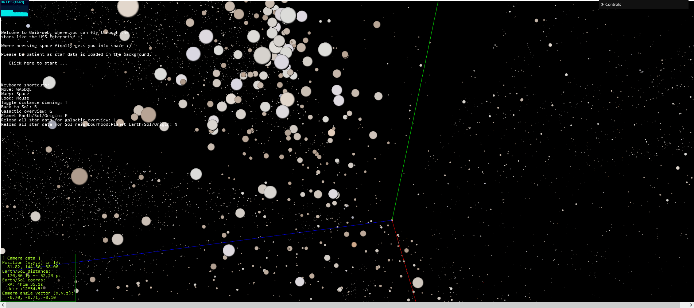

# Gaia-web

Scripts to process GAIA DR3+ data and convert it into a Three.js visualization for the web.

A word only conveys a milli-picture, so here is screenshot of work in progress:

One could say a picture only conveys a mill-VR scene, so hopefully I can host a semi-finished version somewhere that can handle some data usage.

# TODO:

- Process complete data set and split in interesting sections, e.g.:
  - Galactic outline (if descernable)
  - Local neighbourhood only
- Annotate interesting features, e.g.:
  - Open clusters
  - Globular clusters (if present in data?)
  - Famous constellations / star systems (binaries etc)
  - known exoplanet hosts
- Allow sharing of location / camera angle via url, e.g. http://site/gwsf#12,45,56@0.5,0.5,0.5 (would need to include selected dataset and sizeAttenuation setting.)
- Separate dataset for Gaia galactic candidates data set, using red-shift to calculate 3D position.

# Credits

The awesome pioneering work done by @flimshaw who used the 2016 Gaia DR1 data to construct a 3D visualization of it:
- Explanation: https://medium.com/@flimshaw/torrenting-the-galaxy-extracting-2-million-3d-stars-from-180gb-of-csvs-457ff70c0f93#.7g0zpkwnk
- The actual 3D demo: https://charliehoey.com/threejs-demos/gaia_dr1.html