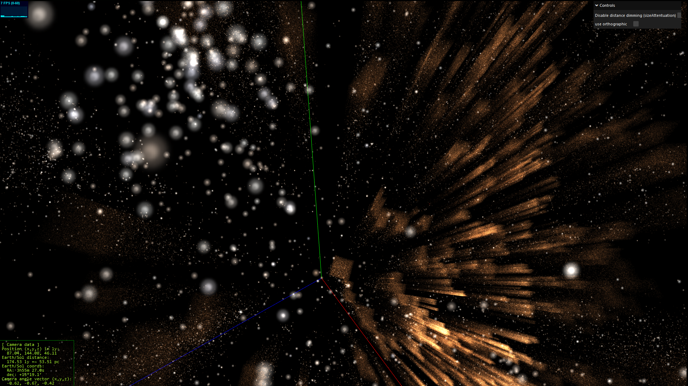

# Gaia-web

Scripts to process GAIA DR3+ data and convert it into a Three.js visualization for the web.

A word only conveys a milli-picture, so here is a screenshot of work in progress, showing a side view of the Hyades cluster with Sol at the axes origin:

A video can be found here:

<iframe
    width="640"
    height="480"
    src="https://www.youtube.com/embed/yiTVA2BYB5I"
    frameborder="0"
    allow="autoplay; encrypted-media"
    allowfullscreen
>
</iframe>

The video shows off the "tour" feature, where the camera visits some open clusters and flys around them. (Yes, annotations and smoother orbits are already on TODO list ;) )

The orange stripes are there because currently I currently only have about 10% of all Gaia data files, chosen at random. Because the Milky Way is overrepresented according to the HEALPix division of the data (See https://www.cosmos.esa.int/web/gaia-users/archive/extract-data and this lovely picture: https://www.cosmos.esa.int/documents/3414525/8760265/GaiaDR3_partitions_galactic.png/a2852722-bd04-d86c-ffc4-ed877b22fc93?t=1667563775853), this will result in "streams" of stars appearing to eminate from the origin/Sol as long as a full data
download hasn't been done yet.

One could say a picture only conveys a mill-VR scene, so hopefully I can host a semi-finished version somewhere that can handle some data usage.

# Why

Ever since learning about the Gaia mission I knew that, besides the obviously real science grownups would use it for, a visualization like this one would also be an amazingly awesome use of the data. Instead of watching the USS Enterprise flying through randomly generated star fields, one could actually explore the galaxy the way it is. I was hoping to one day create this project, but was intimidated by the learning curve of all 3D software. When I recently used Three.js for a work project which also featured a 3D scatter plot, it was much less painful than I imagined and hence applied the knowledge learned there to this project.

# Background

Tech details of how data is extracted/stored/processed:
- csv files are downloaded
- stars with suitable parallax values are stored locally in sqlite
- only those with high confidence parallax are stored in a .js
- the starfield html page loads all .js files
- additional filters are applied while loaded as not all data can be stored
- ...

# TODO:

- Process complete data set and split in interesting sections, e.g.:
  - Galactic outline (if descernable)
  - Local neighbourhood only
  - Search data for clusters by calculating star densities 
- Annotate interesting features, e.g.:
  - Open clusters
  - Globular clusters (if present in data?)
  - Famous constellations / star systems (binaries etc)
  - known exoplanet hosts
  - Use Gaia Sky data for annotations?
  - Make stars glow
  - Add nebulae / dust clouds
  - Implement waypoint tour
- Allow sharing of location / camera angle via url, e.g. http://site/gwsf#12,45,56@0.5,0.5,0.5 (would need to include selected dataset and sizeAttenuation setting.)
- Separate viewer and dataset for Gaia galactic candidates data set, using red-shift to calculate 3D position. Other datasets may have additional/more/better data too (SLOAN?).

# Credits

The awesome pioneering work done by @flimshaw who used the 2016 Gaia DR1 data to construct a 3D visualization of it:
- Explanation: https://medium.com/@flimshaw/torrenting-the-galaxy-extracting-2-million-3d-stars-from-180gb-of-csvs-457ff70c0f93#.7g0zpkwnk
- The actual 3D demo: https://charliehoey.com/threejs-demos/gaia_dr1.html

# Other visualizations

- Gaia Sky (also awesome!): https://zah.uni-heidelberg.de/gaia/outreach/gaiasky
- Gaia's own visualization page: https://gea.esac.esa.int/archive/visualization/
